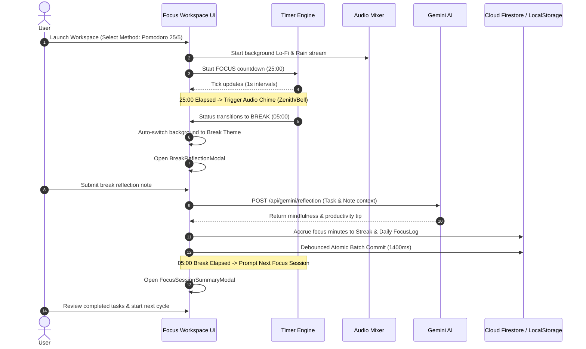
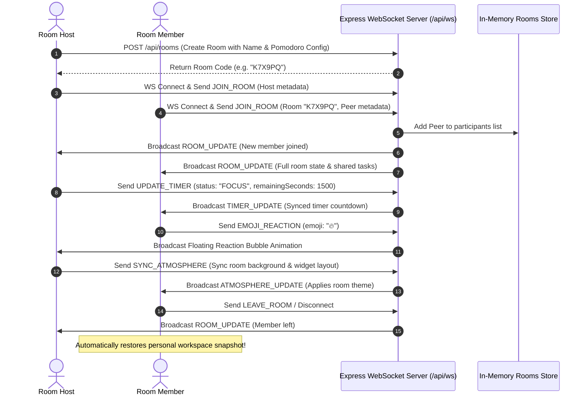
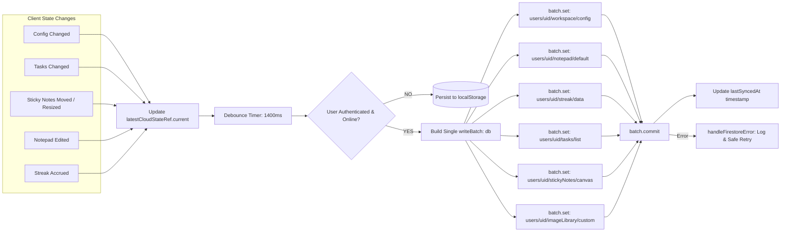

# Focus-Workspace-AI (Airiser / Focus Atmosphere)
### Master System Architecture, UI/UX Design Specification & Business Workflow Blueprint

---

## 📖 Table of Contents
1. [Executive Overview & Vision](#1-executive-overview--vision)
2. [High-Level Architecture & Technology Stack](#2-high-level-architecture--technology-stack)
3. [End-to-End Visual Workflows (Mermaid Diagrams)](#3-end-to-end-visual-workflows-mermaid-diagrams)
   - [3.1 User Focus & Reflection Lifecycle](#31-user-focus--reflection-lifecycle)
   - [3.2 Real-Time Collaborative Room Synchronization](#32-real-time-collaborative-room-synchronization)
   - [3.3 Template Ownership & Lifecycle Engine](#33-template-ownership--lifecycle-engine)
   - [3.4 Firestore Atomic Batching & Throttled Sync Pipeline](#34-firestore-atomic-batching--throttled-sync-pipeline)
4. [Comprehensive Feature Breakdown](#4-comprehensive-feature-breakdown)
   - [4.1 Adaptive Focus Timer Engine](#41-adaptive-focus-timer-engine)
   - [4.2 Multi-Track Audio Mixer & AI Soundscapes](#42-multi-track-audio-mixer--ai-soundscapes)
   - [4.3 Dynamic Backgrounds & Media Resolvers](#43-dynamic-backgrounds--media-resolvers)
   - [4.4 Freeform Drag-and-Drop Sticky Notes Canvas](#44-freeform-drag-and-drop-sticky-notes-canvas)
   - [4.5 Task Planner & Focus Notepad](#45-task-planner--focus-notepad)
   - [4.6 Gemini AI Study Assistant & Analytics](#46-gemini-ai-study-assistant--analytics)
   - [4.7 Collaborative Focus Rooms (WebSockets)](#47-collaborative-focus-rooms-websockets)
   - [4.8 Template Engine & Community Marketplace](#48-template-engine--community-marketplace)
   - [4.9 Daily Streak Engine & Gamification](#49-daily-streak-engine--gamification)
   - [4.10 Snapshot Rollback & Workspace Customizer](#410-snapshot-rollback--workspace-customizer)
5. [UI / UX Design System & Component Hierarchy](#5-ui--ux-design-system--component-hierarchy)
   - [5.1 Aesthetic Philosophy & Color Tokens](#51-aesthetic-philosophy--color-tokens)
   - [5.2 Floating Navigation & Dock Placement](#52-floating-navigation--dock-placement)
   - [5.3 Component Tree](#53-component-tree)
6. [Data Schemas & API Specifications](#6-data-schemas--api-specifications)
   - [6.1 Core TypeScript Interfaces](#61-core-typescript-interfaces)
   - [6.2 Backend REST API Endpoints](#62-backend-rest-api-endpoints)
   - [6.3 WebSocket Protocol & Payloads](#63-websocket-protocol--payloads)
   - [6.4 Firestore Collections & Security Rules](#64-firestore-collections--security-rules)
7. [Step-by-Step Clone, Setup & Deployment Guide](#7-step-by-step-clone-setup--deployment-guide)

---

## 1. Executive Overview & Vision

**Focus-Workspace-AI** (also known as **Airiser** / **Focus Atmosphere**) is an all-in-one, ultra-customizable ambient focus environment designed for deep knowledge workers, coders, students, and collaborative study groups. 

Unlike traditional static Pomodoro timers, Focus-Workspace-AI unites:
1. **Dynamic Visual Environments:** 4K video loops, live anime aesthetic motion, ambient pixel art, and direct media link resolvers (Google Photos, Unsplash, YouTube).
2. **Multi-Track Audio Mixing:** Self-hosted Lo-Fi beats, layered natural soundscapes (rain, cafe, birds, campfire, waves), and **Gemini-powered AI Soundscape Synthesis**.
3. **Scientific Timer Workflows:** Pomodoro (25/5/15), 52/17 Rule, Ultradian 90/20, Flowmodoro (stopwatch flow), and custom configurable intervals.
4. **Interactive Spatial Workspace:** Drag-and-drop 60fps sticky notes canvas with client-side image compression & clipboard paste, markdown notepad with PDF export, and integrated task planning.
5. **Contextual AI Intelligence:** Multimodal study assistant powered by Google Gemini (Gemini 2.5 Flash / Flash-Lite / Pro fallback) for task breakdown, session summarization, flashcards, and post-focus reflections.
6. **Real-Time Multiplayer Focus Rooms:** 6-character room codes with bidirectional WebSocket synchronization for timer state, member presence, reactions, shared task checklists, scratchpads, and live workspace theme synchronization.
7. **Workspace Template Engine & Marketplace:** Context-aware template saving (Personal vs Room templates), automatic personal layout restoration upon leaving rooms, and a public community marketplace.
8. **Resilient Offline-First Data Pipeline:** Local-first localStorage caching with throttled 1400ms atomic Firestore batching to eliminate write exhaustion errors.

---

## 2. High-Level Architecture & Technology Stack

```
                                  +-------------------------------------------------------+
                                  |                     CLIENT BROWSER                    |
                                  |  (React 19, TypeScript, Tailwind CSS v4, Motion API)  |
                                  +---------------------------+---------------------------+
                                                              |
                                  +---------------------------+---------------------------+
                                  |                                                       |
                             HTTP / REST & WS                                        Direct SDK
                                  |                                                       |
                                  v                                                       v
                 +--------------------------------+                     +-----------------------------------+
                 |         EXPRESS SERVER         |                     |         FIREBASE SERVICES         |
                 |      (Node.js / tsx / Vite)    |                     |                                   |
                 +----------------+---------------+                     | - Firebase Auth (Google / Anon)   |
                                  |                                     | - Cloud Firestore (Atomic Batches)|
            +---------------------+---------------------+               | - Firestore Security Rules        |
            |                     |                     |               +-----------------------------------+
            v                     v                     v
+---------------------+ +--------------------+ +--------------------+
|  Google Gemini API  | |  WebSocket Hub     | | Media Resolution   |
|  (@google/genai)    | |  (Rooms & Presence)| | (Proxy & Uploads)  |
+---------------------+ +--------------------+ +--------------------+
```

### Stack Components:
- **Frontend Framework:** React 19 + TypeScript + Vite 6.
- **Styling & Layout:** Tailwind CSS v4, Vanilla CSS variables, Glassmorphism backdrop filters, custom CSS animations.
- **Animation & Icons:** `motion` (Framer Motion), `lucide-react`.
- **Visualization & Export:** `recharts` for productivity analytics, `jspdf` + `html2canvas` for PDF note generation.
- **Client Storage & Compression:** Custom Canvas-based image optimizer (`optimizeImage`), safe JSON localStorage helpers.
- **Backend Server:** Node.js, Express, `ws` (WebSocket Server), `tsx` (runtime TypeScript), `esbuild` (production bundling).
- **AI Service:** `@google/genai` with model fallback (`gemini-2.5-flash` primary -> `gemini-2.5-pro` -> `gemini-1.5-flash` fallback).
- **Authentication & Database:** Firebase Auth (Google OAuth2 + Guest mode), Cloud Firestore.

---

## 3. End-to-End Visual Workflows (Mermaid Diagrams)

### 3.1 User Focus & Reflection Lifecycle



---

### 3.2 Real-Time Collaborative Room Synchronization



---

### 3.3 Template Ownership & Lifecycle Engine

```mermaid
flowchart TD
    Start([User opens Template Modal / Switcher]) --> CheckContext{Is Room Active?<br>roomId != null}
    
    CheckContext -- YES (In Collaborative Room) --> RoomScope[Scope: Room Template Context]
    RoomScope --> SaveRoom[Save Template via saveRoomTemplate]
    SaveRoom --> WriteRoomFS[(Firestore: rooms/{roomId}/templates)]
    SaveRoom --> CacheRoomLocal[Cache to local room storage]
    SaveRoom --> ApplyRoom[Apply template to current room]
    
    CheckContext -- NO (Personal Workspace) --> PersonalScope[Scope: Personal Template Context]
    PersonalScope --> SavePersonal[Save Template via savePersonalTemplate]
    SavePersonal --> WriteUserFS[(Firestore: users/{uid}/templates)]
    SavePersonal --> SetActiveTmpl[Set as activeTemplate in App state]
    
    SetActiveTmpl --> ToggleSync{isTemplateAutoSync Enabled?}
    ToggleSync -- TRUE --> DebouncedAutoSync[Throttled 1400ms Auto-Sync saves workspace changes back to template]
    ToggleSync -- FALSE (Default) --> StaticLoaded[Template applied statically without mutating template doc]
    
    subgraph Room Transition Lifecycle
        JoinRoom[User Joins / Creates Room] --> SnapshotPersonal[Snapshot Personal Layout to 'airiser_personal_workspace_snapshot']
        SnapshotPersonal --> SetSyncFalse1[Reset isTemplateAutoSync = false]
        
        LeaveRoom[User Exits Room] --> RestorePersonal[Read 'airiser_personal_workspace_snapshot']
        RestorePersonal --> HasSnapshot{Snapshot Exists?}
        HasSnapshot -- YES --> LoadSaved[Restore user's saved config, tasks, notes & active template]
        HasSnapshot -- NO --> LoadDefault[Restore DEFAULT_WORKSPACE_CONFIG & DEFAULT_TEMPLATES]
        LoadSaved --> SetSyncFalse2[Reset isTemplateAutoSync = false]
        LoadDefault --> SetSyncFalse2
        SetSyncFalse2 --> ToastNotif[Display: Restored personal workspace layout]
    end
```

---

### 3.4 Firestore Atomic Batching & Throttled Sync Pipeline



---

## 4. Comprehensive Feature Breakdown

### 4.1 Adaptive Focus Timer Engine
- **Supported Scientific Focus Methods:**
  1. `pomodoro`: 25 min work / 5 min short break / 15 min long break (configurable).
  2. `52_17`: 52 min high-intensity focus / 17 min rest.
  3. `ultradian`: 90 min natural circadian rhythm block / 20 min deep recovery.
  4. `flowmodoro`: Open-ended counting stopwatch; break calculated proportionally upon completion.
  5. `custom`: User-defined work, short break, and long break intervals.
- **Audio Chime System:** HTML5 Web Audio synthesis generating high-clarity bell tones (`Zenith`, `Bell`, `Digital`, `Gong`, `Subtle`).
- **Freeform Draggable Timer Widget:** Supports dragging anywhere on the screen with 2D coordinate persistence across reloads (`localStorage.getItem('airiser_timer_position')`).
- **Display Modes:**
  - **Standard Mode:** Displays full workspace widgets, sidebars, dock, and audio bar.
  - **Fullscreen Minimalist Mode:** Maximizes timer and background; collapses non-essential side panels.
  - **Zen Mode:** Total zero-distraction view hiding all toolbar controls and buttons, retaining only clock and subtle hover controls.

### 4.2 Multi-Track Audio Mixer & AI Soundscapes
- **Self-Hosted Lo-Fi Beats:** High-quality local tracks (`/audio/lofi-study.mp3`, `chill-lofi.mp3`, `tokyo-ambient.mp3`, `calm-piano.mp3`, `acoustic-chill.mp3`, `ambient-relax.mp3`).
- **Layered Nature Soundscapes:** Independent volume sliders for 6 ambient channels: *Gentle Rain, Forest Birds, Ocean Waves, Cafe Ambiance, White Noise, Campfire*.
- **Custom Audio & Stream Links:** Supports adding custom audio URLs, MP3 stream links, or local audio file uploads.
- **AI Soundscape Generator (`AiSoundGeneratorModal.tsx`):**
  - Sends user study context, desired mood, and active timer method to Gemini.
  - Returns recommended ambient mixes, tailored audio prompts, and structured atmospheric parameters.

### 4.3 Dynamic Backgrounds & Media Resolvers
- **Curated Live Loops:** 4K video streams, animated pixel art, cyberpunk nightscapes, cozy winter cabins, anime study rooms, and minimalist gradient motions.
- **Work vs. Break Atmosphere Duality:** Automatically switches background visual when timer transitions from `FOCUS` to `BREAK`.
- **Media Link Resolver (`/api/media/resolve-url` & `/api/media/proxy`):**
  - Resolves Google Photos public album/photo share URLs.
  - Resolves Unsplash high-res photography.
  - Supports direct video embeds (MP4, WebM) and YouTube iframe embeds.
  - Server-side CORS proxy for external media resources.
- **Visual FX Controls:** Dynamic Vignette, Film Grain texture, Gaussian Blur slider, and Darkness Overlay percentage.

### 4.4 Freeform Drag-and-Drop Sticky Notes Canvas
- **60fps/120fps Pointer Capture:** Hardware-accelerated dragging and resizing using `setPointerCapture` and `requestAnimationFrame`.
- **Rich Note Features:**
  - Color palette: *Yellow, Mint, Lavender, Peach, Sky, Dark Obsidian*.
  - Pinning toggle (`isPinned` prevents accidental dragging).
  - Quick Sizing Presets: *Compact (220x180), Medium (300x260), Large (400x350), Wide (480x260)* and 2D corner drag resizing.
  - **Media Embedding:** Drag-and-drop image file onto note, paste clipboard image (`⌘V` / `Ctrl+V`), or embed image URLs.
  - **Client-Side Compression:** High-efficiency HTML5 Canvas image optimization to keep Firestore document payloads under limit.

### 4.5 Task Planner & Focus Notepad
- **Task Planner Sidebar (`TaskPlannerSidebar.tsx`):**
  - Categorized tasks with Priority badges (`high`, `medium`, `low`).
  - Estimated Pomodoro session counter per task.
  - Inline completion, task editing, deletion, and quick-add during focus sessions.
- **Focus Notepad Panel (`NotepadPanel.tsx`):**
  - Rich markdown writing area with quick-insert formatting chips (headers, lists, checkboxes, quotes, code blocks).
  - Word counter and character counter.
  - One-click export to PDF (`jspdf` + `html2canvas`) and Markdown (`.md`).

### 4.6 Gemini AI Study Assistant & Analytics
- **AI Study Assistant Panel (`AiAssistantPanel.tsx`):**
  - Powered by `@google/genai` (SDK endpoint `/api/gemini/chat`).
  - Contextual awareness: automatically receives user's active tasks, notepad content, and current timer method.
  - Quick prompts: *Break Down Task, Generate Flashcards, Explain Simply, 5-Minute Quiz, Productivity Advice*.
- **Post-Session Summarizer & Reflection:**
  - AI analysis of focus duration vs tasks accomplished.
  - Post-break mindfulness check-in saving reflections to user focus history.
- **Analytics & History Modal (`StatsAnalyticsModal.tsx`):**
  - Visual charts powered by `recharts`: Daily focus duration over time, task completion velocity, focus method distribution.

### 4.7 Collaborative Focus Rooms (WebSockets)
- **Live Collaborative Studying (`RealtimeRoomModal.tsx` & `LiveRoomFloatingBar.tsx`):**
  - Create room with custom name, description, privacy mode, and Pomodoro settings.
  - Generates 6-character room codes for instant peer joining.
  - **Real-Time Presence:** Live list of participants, avatars, active tasks, and status (`active`, `break`, `idle`).
  - **Synchronized Countdown Timer:** Host or members broadcast timer start/pause/skip updates across all clients.
  - **Floating Emoji Reactions:** Real-time animated emoji floating bubbles (`🔥`, `👏`, `☕`, `💪`, `✨`).
  - **Shared Checklist & Collaborative Scratchpad:** Synchronous task toggling with audit messages in live room chat.
  - **Atmosphere Synchronization:** Host can broadcast full workspace background and audio settings to all room members.
  - **Seamless Context Recovery:** Leaving a room instantly restores personal workspace layout without data contamination.

### 4.8 Template Engine & Community Marketplace
- **Automatic Context Detection:**
  - If inside a room: Saves as a Room Template (`rooms/{roomId}/templates`).
  - If in personal mode: Saves as a Personal Template (`users/{uid}/templates`).
- **Active Template Auto-Sync Engine:**
  - When an active template is linked and auto-sync is enabled, all workspace changes automatically update the template document.
  - Defaults to `false` on initial load and room transitions to protect presets from unintended overwrites.
- **Top Navigation Active Template Badge (`FloatingWorkspaceBadge.tsx`):**
  - Displays active template name with context indicator (`Personal Template` vs `Room Template` + room code).
  - Clicking badge opens the Template Management modal.
- **Community Marketplace (`MarketplaceModal.tsx`):**
  - Public marketplace allowing users to browse, search, preview, like, and apply community templates.

### 4.9 Daily Streak Engine & Gamification
- **Streak Calculation Engine (`src/utils/streakUtils.ts`):**
  - Tracks consecutive daily focus sessions evaluated against local user calendar days.
  - Milestone unlock alerts for 3, 7, 14, and 30 consecutive focus days.
  - Interactive celebration toasts with flame animations and cloud synchronization.

### 4.10 Snapshot Rollback & Workspace Customizer
- **Workspace Customizer Drawer (`CustomizerDrawer.tsx`):**
  - Tabbed controls for Backgrounds, Audio Mix, Timer Method, Layout Positions, Appearance, and Themes.
- **Safe Reset & Instant Version Rollback:**
  - Performing a factory reset automatically captures a full `RollbackSnapshot` before resetting state.
  - Custom user images in the library are preserved across resets.
  - One-click `Rollback Version` button instantly restores previous workspace layout.

---

## 5. UI / UX Design System & Component Hierarchy

### 5.1 Aesthetic Philosophy & Color Tokens
- **Theme:** Dark-tech luxury & obsidian minimalism with rich atmospheric lighting.
- **Background Base:** Ultra-deep obsidian `#0a0502` / slate-950 `#020617`.
- **Glassmorphism Panels:** `bg-slate-950/80`, `backdrop-blur-xl`, `border border-slate-800/80`.
- **Accent Glows:**
  - **Focus Amber:** `text-amber-400`, `bg-amber-500/20`, `border-amber-500/40` (Timer & Sticky Notes).
  - **Deep Indigo:** `text-indigo-400`, `bg-indigo-600/30`, `border-indigo-500/40` (Primary Actions & AI).
  - **Emerald Pulse:** `text-emerald-400`, `bg-emerald-500/20` (Room Sync & Active State).
  - **Rose Accent:** `text-rose-400`, `bg-rose-500/20` (Breaks & Session Resets).
- **Typography:** Modern clean sans-serif typography (`Inter`, `Outfit`, or system font stack) with crisp letter-spacing and numeric tabular figures (`font-mono` / `tabular-nums` for timers).

### 5.2 Floating Navigation & Dock Placement

```
+-----------------------------------------------------------------------------------------------+
| [🔥 Streak 5] [Active Template Pill: Pomodoro Flow ▾]   [ 🔍 Search (⌘K) ]   [User Avatar ▾]  | <- Top Bar
+-----------------------------------------------------------------------------------------------+
|                                                                                               |
|                                                                                               |
|                                     +-------------------+                                     |
|                                     |    24:59 (FOCUS)  | <- Draggable Center Timer           |
|                                     |  [▶ Start] [Reset]|                                     |
|                                     +-------------------+                                     |
|                                                                                               |
|  [ Sticky Note 1 ]                                                       [ Sticky Note 2 ]    |
|  (Freeform Canvas)                                                       (Embedded Image)     |
|                                                                                               |
+-----------------------------------------------------------------------------------------------+
| [ + Sticky Note ] [⚡ Auto-Sync Pill]                    [ 🎵 Lo-Fi Audio Mixer | Vol 65% ▾ ]| <- Bottom Docks
+-----------------------------------------------------------------------------------------------+
```

- **Top Navigation (`FloatingWorkspaceBadge.tsx`):** Centered/floating top toolbar with daily streak badge, active template pill, global command search bar (`⌘K`), quick-tool shortcuts, and user profile authentication button.
- **Bottom-Left Dock (`App.tsx`):** Unified non-overlapping flex container (`fixed bottom-6 left-6 z-40 flex items-center gap-3`) containing the `+ Sticky Note` creator button and the active template auto-sync status pill.
- **Bottom-Right Audio Player (`AudioPlayer.tsx`):** Floating audio mixer dock with play/pause, volume controls, channel selector, sound generator trigger, and track info.

### 5.3 Component Tree

```
src/
├── App.tsx                              # Central state container, sync pipeline, and global dock
├── components/
│   ├── BackgroundLayer.tsx              # Video, image, motion background renderer
│   ├── TimerWidget.tsx                  # Main draggable countdown timer & method switcher
│   ├── AudioPlayer.tsx                  # Multi-track audio mixer & sound layer controls
│   ├── AudioUploadModal.tsx             # Custom sound file upload & streaming URL modal
│   ├── StickyNotesCanvas.tsx            # Freeform spatial drag-and-drop notes canvas
│   ├── TaskPlannerSidebar.tsx           # Collapsible task checklist and priority manager
│   ├── NotepadPanel.tsx                 # Focus markdown notepad with PDF export
│   ├── AiAssistantPanel.tsx             # Gemini AI interactive study chat assistant
│   ├── AiSoundGeneratorModal.tsx        # Gemini AI soundscape generator
│   ├── FloatingWorkspaceBadge.tsx       # Top toolbar, streak indicator, template visualizer
│   ├── GlobalSearchBar.tsx              # Command palette (⌘K) for full workspace actions
│   ├── CustomizerDrawer.tsx             # Deep theme & workspace layout configuration drawer
│   ├── RealtimeRoomModal.tsx            # Real-time multiplayer collaborative room dialog
│   ├── LiveRoomFloatingBar.tsx          # Floating bottom pill during active room session
│   ├── TemplateModal.tsx                # Context-aware template switcher & manager
│   ├── MarketplaceModal.tsx             # Community template marketplace
│   ├── StatsAnalyticsModal.tsx          # Focus statistics & Recharts productivity graphs
│   ├── BreakReflectionModal.tsx         # Post-focus break reflection modal
│   ├── FocusSessionSummaryModal.tsx     # Completed session summary & statistics modal
│   ├── ColorPickerControl.tsx           # Reusable RGBA/HEX color picker
│   ├── LandingPage.tsx                  # Interactive visitor landing page & feature showcase
│   ├── UserAccountButton.tsx            # Google OAuth / User account profile trigger
│   └── ErrorBoundary.tsx                # React error boundary component
├── data/
│   ├── defaultWorkspace.ts              # Factory default configurations & tasks
│   ├── presetBackgrounds.ts             # Curated work & break background collections
│   ├── presetAudio.ts                   # Self-hosted audio track definitions
│   └── presetTemplates.ts               # Default starter workspace templates
├── utils/
│   ├── useDebounce.ts                   # Throttling & debouncing hooks for Firestore writes
│   ├── storage.ts                       # Safe JSON localStorage wrapper with error fallbacks
│   ├── streakUtils.ts                   # Consecutive focus streak math & milestone logic
│   └── imageOptimizer.ts                # Client-side HTML5 canvas image compressor
└── firebase.ts                          # Firebase Auth, Cloud Firestore atomic batching client
```

---

## 6. Data Schemas & API Specifications

### 6.1 Core TypeScript Interfaces

```typescript
// Workspace Configuration
export interface WorkspaceConfig {
  background: {
    workItems: BackgroundItem[];
    breakItems: BackgroundItem[];
    currentWorkId?: string;
    currentBreakId?: string;
    videoVolume?: number;
    blur?: number;
    vignette?: boolean;
    filmGrain?: boolean;
    darknessOverlay?: number;
  };
  audio: {
    musicVolume: number;
    ambientVolumes: Record<string, number>;
    currentTrackId: string;
    isPlaying: boolean;
  };
  method: {
    type: 'pomodoro' | '52_17' | 'ultradian' | 'flowmodoro' | 'custom';
    workMinutes: number;
    shortBreakMinutes: number;
    longBreakMinutes: number;
    longBreakInterval: number;
    soundChime: string;
    autoStartBreaks?: boolean;
  };
  layout: {
    timerPosition: 'center' | 'top-right' | 'minimal-dock' | 'custom';
    positions?: Record<string, { x: number; y: number }>;
  };
  appearance: {
    clockFormat: '24h' | '12h';
    showMusicBar?: boolean;
    showStickyNotes?: boolean;
    themeColor?: string;
  };
}

// Workspace Template
export interface Template {
  id: string;
  creatorId: string;
  creatorName: string;
  creatorPhoto?: string;
  name: string;
  description: string;
  category?: string;
  tags?: string[];
  thumbnail: string;
  config: WorkspaceConfig;
  tasks?: Task[];
  stickyNotes?: StickyNote[];
  notepad?: string;
  isPublic?: boolean;
  roomId?: string;                      // If set, scopes template to room
  contextType?: 'personal' | 'room';    // Auto-detected template context
  createdAt: string;
  updatedAt: string;
}

// Freeform Sticky Note
export interface StickyNote {
  id: string;
  text: string;
  color: string;
  x: number;
  y: number;
  width?: number;
  height?: number;
  isPinned?: boolean;
  imageUrl?: string;
  imageHeight?: number;
  imageFit?: 'cover' | 'contain';
}

// Focus Task
export interface Task {
  id: string;
  title: string;
  completed: boolean;
  priority?: 'high' | 'medium' | 'low';
  estimatedPomodoros?: number;
  completedPomodoros?: number;
  createdAt: string;
}
```

### 6.2 Backend REST API Endpoints

| Method | Endpoint | Description | Payload / Query | Response |
| :--- | :--- | :--- | :--- | :--- |
| `POST` | `/api/gemini/chat` | AI Study Assistant conversation | `{ message, history, context }` | `{ reply: string }` |
| `POST` | `/api/gemini/reflection` | Post-focus mindfulness reflection | `{ tasks, notes, duration }` | `{ reflection: string }` |
| `POST` | `/api/gemini/summary` | End-of-session summary synthesis | `{ sessionData, tasks }` | `{ summary: string }` |
| `POST` | `/api/gemini/soundscape`| AI soundscape preset generator | `{ mood, method, taskContext }` | `{ soundscape: object }` |
| `GET`  | `/api/templates` | Retrieve public marketplace templates | `?category=&search=` | `Template[]` |
| `POST` | `/api/templates` | Publish community template | `Template` object | `{ success: true, id }` |
| `POST` | `/api/rooms` | Create collaborative focus room | `{ name, config, host }` | `{ roomCode, room }` |
| `GET`  | `/api/rooms/:code` | Get room status & participant count | `roomCode` in URL | `RoomState` object |
| `POST` | `/api/media/resolve-url`| Resolve Google Photos/Unsplash links| `{ url: string }` | `{ directUrl: string }` |
| `POST` | `/api/media/upload` | Upload custom image/audio asset | `multipart/form-data` | `{ fileUrl: string }` |
| `GET`  | `/api/media/proxy` | Stream external media avoiding CORS | `?url=https://...` | Binary stream |

### 6.3 WebSocket Protocol & Payloads

WebSocket connection endpoint: `ws://localhost:3001/api/ws` (or `wss://domain.com/api/ws`).

```typescript
// Incoming Client -> Server Message Types
type ClientMessage =
  | { type: 'JOIN_ROOM'; roomCode: string; participant: Participant }
  | { type: 'LEAVE_ROOM'; roomCode: string }
  | { type: 'UPDATE_TIMER'; roomCode: string; timerState: TimerState }
  | { type: 'EMOJI_REACTION'; roomCode: string; emoji: string; senderName: string; senderId: string }
  | { type: 'SEND_CHAT'; roomCode: string; message: ChatMessage }
  | { type: 'UPDATE_TASKS'; roomCode: string; tasks: Task[] }
  | { type: 'TOGGLE_TASK'; roomCode: string; taskId: string; actorName: string }
  | { type: 'UPDATE_SCRATCHPAD'; roomCode: string; scratchpad: string }
  | { type: 'SYNC_ATMOSPHERE'; roomCode: string; config: WorkspaceConfig; senderName?: string }
  | { type: 'SYNC_WIDGET_POSITION'; roomCode: string; widget: string; position: { x: number; y: number } }
  | { type: 'UPDATE_STICKY_NOTES'; roomCode: string; notes: StickyNote[] }
  | { type: 'VOTE_SKIP'; roomCode: string; participantId: string };

// Outgoing Server -> Client Message Types
type ServerMessage =
  | { type: 'ROOM_UPDATE'; room: RoomState }
  | { type: 'TIMER_UPDATE'; timerState: TimerState }
  | { type: 'EMOJI_REACTION'; emoji: string; senderName: string; senderId: string }
  | { type: 'WIDGET_POSITION_UPDATE'; widget: string; position: { x: number; y: number }; senderId: string }
  | { type: 'ATMOSPHERE_UPDATE'; config: WorkspaceConfig };
```

### 6.4 Firestore Collections & Security Rules

```javascript
rules_version = '2';
service cloud.firestore {
  match /databases/{database}/documents {
    
    // User Profiles & Private Subcollections
    match /users/{userId} {
      allow read, write: if request.auth != null && request.auth.uid == userId;
      
      match /workspace/{docId} {
        allow read, write: if request.auth != null && request.auth.uid == userId;
      }
      match /templates/{templateId} {
        allow read, write: if request.auth != null && request.auth.uid == userId;
      }
      match /tasks/{docId} {
        allow read, write: if request.auth != null && request.auth.uid == userId;
      }
      match /stickyNotes/{docId} {
        allow read, write: if request.auth != null && request.auth.uid == userId;
      }
      match /notepad/{docId} {
        allow read, write: if request.auth != null && request.auth.uid == userId;
      }
      match /streak/{docId} {
        allow read, write: if request.auth != null && request.auth.uid == userId;
      }
      match /imageLibrary/{docId} {
        allow read, write: if request.auth != null && request.auth.uid == userId;
      }
      match /rollbackSnapshot/{docId} {
        allow read, write: if request.auth != null && request.auth.uid == userId;
      }
    }
    
    // Room Templates Subcollection
    match /rooms/{roomId}/templates/{templateId} {
      allow read: if true;
      allow write: if request.auth != null;
    }

    // Community Marketplace Templates
    match /templates/{templateId} {
      allow read: if true;
      allow create: if request.auth != null && request.resource.data.creatorId == request.auth.uid;
      allow update: if request.auth != null;
      allow delete: if request.auth != null && resource.data.creatorId == request.auth.uid;
    }
  }
}
```

---

## 7. Step-by-Step Clone, Setup & Deployment Guide

### Prerequisites
- **Node.js:** v18.0.0 or higher (v20+ recommended).
- **Package Manager:** `npm`, `pnpm`, or `bun`.
- **Firebase Project:** A Google Firebase project with Auth (Google Sign-In) and Cloud Firestore enabled.
- **Gemini API Key:** Google AI Studio Gemini API key ([Get a Gemini API Key](https://aistudio.google.com/)).

---

### Step 1: Clone Repository & Install Dependencies

```bash
# 1. Clone repository
git clone https://github.com/your-username/Focus-Workspace-with-AI.git
cd Focus-Workspace-with-AI

# 2. Install dependencies
npm install
```

---

### Step 2: Configure Environment Variables

Create a `.env.local` or `.env` file in the project root:

```env
# Gemini API Key (Required for AI chat, sound generator & reflections)
GEMINI_API_KEY=your_google_gemini_api_key_here

# Express Server Port (Default: 3001)
PORT=3001

# Optional: Firebase Web Config (if overriding src/firebase.ts defaults)
VITE_FIREBASE_API_KEY=your_api_key
VITE_FIREBASE_AUTH_DOMAIN=your_project.firebaseapp.com
VITE_FIREBASE_PROJECT_ID=your_project_id
VITE_FIREBASE_STORAGE_BUCKET=your_project.appspot.com
VITE_FIREBASE_MESSAGING_SENDER_ID=your_sender_id
VITE_FIREBASE_APP_ID=your_app_id
```

---

### Step 3: Run in Development Mode

The development server runs Express with integrated Vite middleware and WebSocket support:

```bash
npm run dev
```
Open [http://localhost:3001](http://localhost:3001) in your browser.

---

### Step 4: Validate & Build for Production

```bash
# 1. Run full TypeScript static analysis
npm run lint

# 2. Build client bundle with Vite and server bundle with esbuild
npm run build

# 3. Start production server
npm start
```

---

### Step 5: Deploy to Cloud (Docker / GCP Cloud Run / Render)

Create a `Dockerfile` for containerized deployments:

```dockerfile
FROM node:20-alpine AS builder
WORKDIR /app
COPY package*.json ./
RUN npm ci
COPY . .
RUN npm run build

FROM node:20-alpine AS runner
WORKDIR /app
ENV NODE_ENV=production
ENV PORT=3001
COPY package*.json ./
RUN npm ci --omit=dev
COPY --from=builder /app/dist ./dist
COPY --from=builder /app/public ./public

EXPOSE 3001
CMD ["node", "dist/server.cjs"]
```

Build and run container:
```bash
docker build -t focus-workspace-ai .
docker run -p 3001:3001 -e GEMINI_API_KEY="your_api_key" focus-workspace-ai
```

---

## 8. Summary & Reproduction Checklist for Teams and AI Agents

| Feature Component | File Location | Key Function / Class |
| :--- | :--- | :--- |
| **Atomic Cloud Sync** | `src/firebase.ts` | `saveUserDataToCloud` with `writeBatch(db)` |
| **Room Exit Layout Restoration** | `src/App.tsx` | `handleLeaveRoom` restoring `airiser_personal_workspace_snapshot` |
| **Context-Aware Templates** | `src/components/TemplateModal.tsx` | `saveRoomTemplate` vs `savePersonalTemplate` |
| **Unified Bottom-Left Dock** | `src/App.tsx`, `StickyNotesCanvas.tsx` | `fixed bottom-6 left-6 z-40 flex items-center gap-3` |
| **Throttled Firestore Debouncer** | `src/utils/useDebounce.ts`, `App.tsx` | `latestCloudStateRef` with 1400ms delay |
| **Self-Hosted Audio Engine** | `src/data/presetAudio.ts`, `AudioPlayer.tsx`| `/public/audio/*.mp3` PCM assets + Promise error handlers |
| **WebSocket Multiplayer Hub** | `server.ts` | `WebSocketServer` handling `JOIN_ROOM`, `UPDATE_TIMER`, `SYNC_ATMOSPHERE` |
| **Gemini AI Endpoint Fallback** | `server.ts` | `generateGeminiContentWithFallback` |

*This document serves as the master specification for Focus-Workspace-AI. Any team or AI coding agent can reproduce the exact system behavior, UI layout, WebSocket protocol, and data persistence guarantees by following this specification.*
